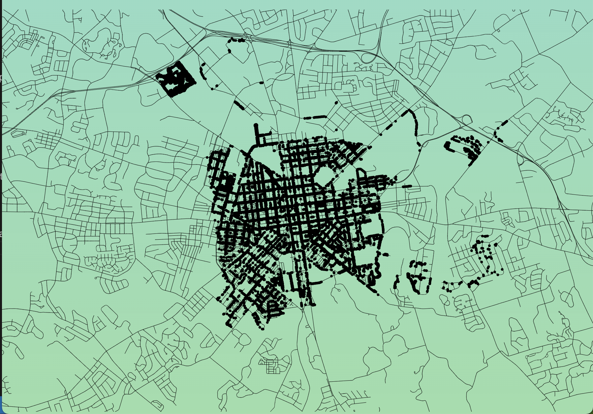
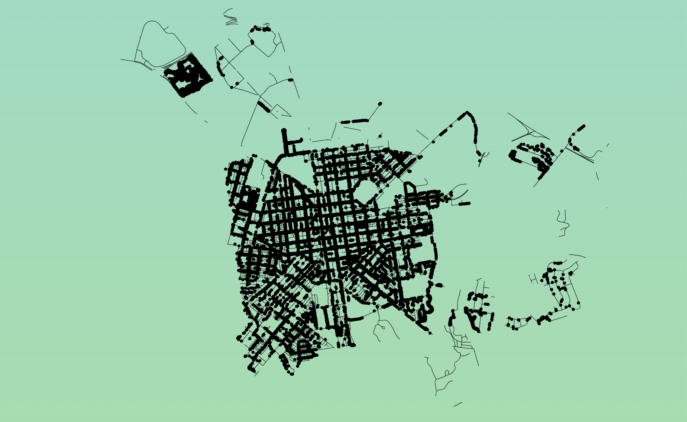
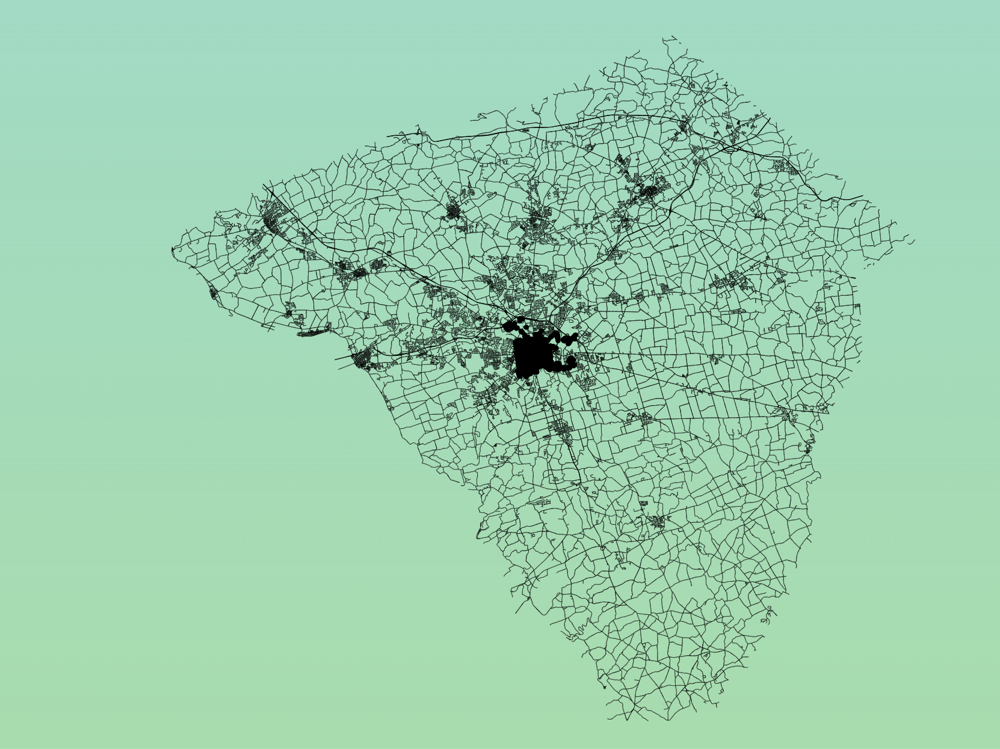

# Week 4

## References:

This week I'll aim to get the trees mapped, and allow a user to click on a tree to see the info.

I clicked a lot of links:

https://medium.datadriveninvestor.com/getting-started-with-d3-js-maps-e721ba6d8560

https://www.tutorialsteacher.com/d3js/create-svg-elements-in-d3js

https://www.d3indepth.com/geographic/

has a bounding box:

https://nominatim.openstreetmap.org/search.php?city=Lancaster&state=Pennsylvania&format=jsonv2

https://bl.ocks.org/Andrew-Reid/4f3e3cdf708036ed076075b937357826

https://gist.github.com/JamesChevalier/b861388d35476cee4fcc3626a60af60f

https://stackoverflow.com/questions/62333032/lets-make-a-topojson-map-and-view-it-with-d3-js

https://github.com/topojson/topojson

https://github.com/d3/d3-geo#projections

https://www.tutorialsteacher.com/d3js/create-svg-elements-in-d3js

http://using-d3js.com/05_01_paths.html

https://www.d3indepth.com/geographic/

https://bost.ocks.org/mike/map/

https://analyticsindiamag.com/a-map-to-perfection-using-d3-js-to-make-beautiful-web-maps/

https://stackoverflow.com/questions/47750168/d3-us-map-zoom-on-load-to-marked-state

https://wiki.openstreetmap.org/wiki/Overpass_API/Overpass_API_by_Example

https://codepen.io/andybarefoot/pen/oBQKOb

https://medium.com/@andybarefoot/making-a-map-using-d3-js-8aa3637304ee

i think that part of the reason that my map is so weird, is because lancaster2.geojson includes data from a bunch of streets with lancaster somewhere in the record! duh!

this was the key! i noticed it, because when I googled the first street it was in the Uk! Then I looked a bit closer at the data, and looked at it overpass-turbo.edu, and zoomed out, and noticed that there were dots (kind of like mine) in several states.

https://www.google.com/search?q=Preston+Lancaster+Road&rlz=1C5CHFA_enUS978US978&sxsrf=ALiCzsZEkTc_keSLLI8RLEGawvY6NIyvWg%3A1664419569905&ei=8QY1Y_btNubl5NoPnpqUoAo&ved=0ahUKEwi2quKJ_rj6AhXmMlkFHR4NBaQQ4dUDCA4&uact=5&oq=Preston+Lancaster+Road&gs_lcp=Cgxnd3Mtd2l6LXNlcnAQAzIFCAAQgAQyBggAEB4QFjIGCAAQHhAWMgYIABAeEBYyBggAEB4QFjIGCAAQHhAWMgYIABAeEBYyBggAEB4QFjIGCAAQHhAWMggIABAeEBYQCjoJCAAQHhCwAxAHOgcIABAeELADOgkIABAeELADEAhKBAhBGAFKBAhGGABQuAVYuAVgyQhoAXAAeACAAUqIAUqSAQExmAEAoAEByAEKwAEB&sclient=gws-wiz-serp

I tried a bit more to get a query that would work in openmaps, and really was struggling.

so then i decided to do a quick google of geojson data in lancaster, and bingo! i found so much stuff!

https://mapservices.pasda.psu.edu/server/rest/services/pasda/LancasterCounty/MapServer

https://www.pasda.psu.edu/uci/DataSummary.aspx?dataset=1267

https://www.pasda.psu.edu/

this one called "Lancaster County - Road Centerlines and Types"
https://www.pasda.psu.edu/uci/DataSummary.aspx?dataset=1270

is up-to-date and seems to have road centerlines, which im assuming is the central line of the road... rather than having one record for each side of the street.

the only issue so far is that this includes all of lancaster county, rather than just the city. my idea for getting around this (if i cant find a way to query/filter the data) is to set the fitExtent (?) on the projection so that the center is at of the city, and is quite zoomed in so the rest of the county isnt really show. and then maybe have the outer edges become less opaque

some suggestions from class:
https://www.mapbox.com/

other stuff from class, not about my project:
https://neal.fun/deep-sea/
http://therapboard.com/

Other Map Tutorials that I haven't look at yet:

- https://bl.ocks.org/john-guerra/43c7656821069d00dcbc

## Documentation for only displaying Lancaster City instead of all of Lancaster County

The LancasterCounty data structure looks like this:

```json
{
  "type": "FeatureCollection",
  "features": [
    {
      "id": 0,
      "type": "Feature"
      "geometry": {
        "type": "LineString",
        "coordinates": [
          [-76.31711164650034, 40.02758490370382]
          [-76.3166400867301, 40.02729589257975]
        ]
      },
      "properties": {
        "LTWNSH": "LANCASTER CITY",
        "RTWNSH": "LANCASTER CITY"
      }
    }
  ]
}
```

So, I wondered if I would be able to filter the data on the feature's LTWNSH or RTWNSH property equaling "LANCASTER CITY". o

don't know the differenence between the two

LTWNSH had 2766
LTNRSH had 2778

but the different in the mapping btween one or another, or both didnt seem too different (schreenshot)

I am currently using the filtered data for the city projection, and the full street data for the drawing, and get this result:



This is what it looks like with the filtered data for both:


This is what it looks like with the full data for both:



in order to get the text to show up in the spot where i wanted, i started by displaying the labels for every dot on page load... and then just set the opacity to 0. this worked, however, when i went to include the rectangles i noticed that the mouse clicks werent reliable

i think this is because depending on which order i added the cirlce, text, rect and the on click, sometimes the circled (or the clickable thing) would be below the labels

i played around with adding the on click to the g's but with this, the clickable area because pretty large, and with all of the trees in there, it would make it really hard to be certain you were getting the one you expected

then i leveraged adding ids and classes to my text, rect and cirlce omponents

and by using the objectid from my tree data, i was able to select specific ids

i also learned that i can get an elements parent. so i can get the circle's parent (g), and add the rect and text in there on click

now i am trying to add the text and rect on click, and remove all of the previous ones before (by selecting the classname) before the rest of the on clikc happens


the one piece that i think would have made this all easier was if i could get a div to display... not just a text, cirlce, rect, etc
if i could have gotten a div to display, i could have hadd changed the background color with css
but for some reason divs wouldn't display when appened to the g2


selection.raise!!
https://riptutorial.com/d3-js/example/18029/svg--the-drawing-order

https://observablehq.com/@rlesser/automatic-getbbox

https://colorpalettes.net/color-palette-3959/
https://stitchpalettes.com/palette/healthy-greens-spa0359/
https://colorpalettes.net/color-palette-3808/